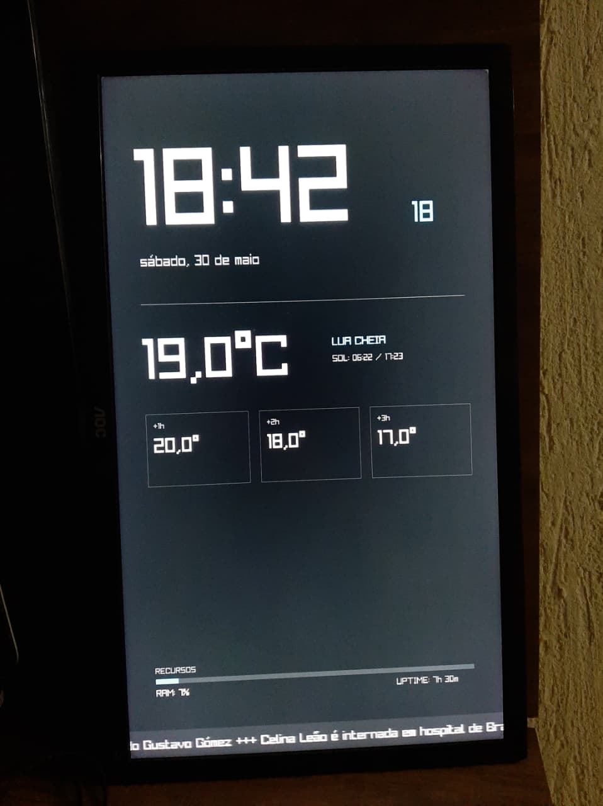

# RayDash 

A minimalist, lightweight, and high-performance information dashboard developed in **C** using **Raylib** and **libcurl**. Specifically designed to run on secondary monitors with a **Vertical-Desktop** (portrait) orientation.

##  Layout & Concept
The project is structured for a resolution of **1050x1680** (9:16 aspect ratio), making it ideal for dedicated vertical monitors positioned next to your main setup (arcade/dashboard secondary monitor style).

### Current Features:
* **Digital Clock:** High visibility with a highlighted seconds counter.
* **Full Date:** Automatically formatted for local Portuguese (`pt_BR.UTF-8`).
* **Weather Monitoring:** Current temperature and forecast for the upcoming hours via the Open-Meteo API.
* **Moon Phases:** Dynamically calculated through an internal lunar cycle algorithm.
* **News Ticker (RSS):** Real-time rotating banner, smoothly cycling between news portals (BBC Brasil and Metrópoles).
* **System Metrics:** Displays system uptime and a RAM usage bar (Linux).


<p align="center">
  
</p>


---

##  Performance & Real-World Consumption
Tested and validated in a real-world environment running **Arch Linux**:

* **Test Hardware:** Intel Core i7-3537U | 8GB RAM
* **Memory Usage (RAM):** Between **69 MB** and **71 MB** (Extremely lightweight)
* **Processor Usage (CPU):** Between **6.5%** and **11.5%**

---

##  How to Build and Run

### 1. Prerequisites (On Arch Linux)
Make sure you have the `gcc` compiler and the required development libraries installed on your system:
```
sudo pacman -S gcc raylib curl
```
To compile the project by linking Raylib, libcurl, and the math library (-lm), run the following command inside the project folder:
```
gcc main.c -o raydash_app -lraylib -lcurl -lm
```

## Execution

### After a successful compilation, simply launch the generated executable:
```
./raydash_app
```
